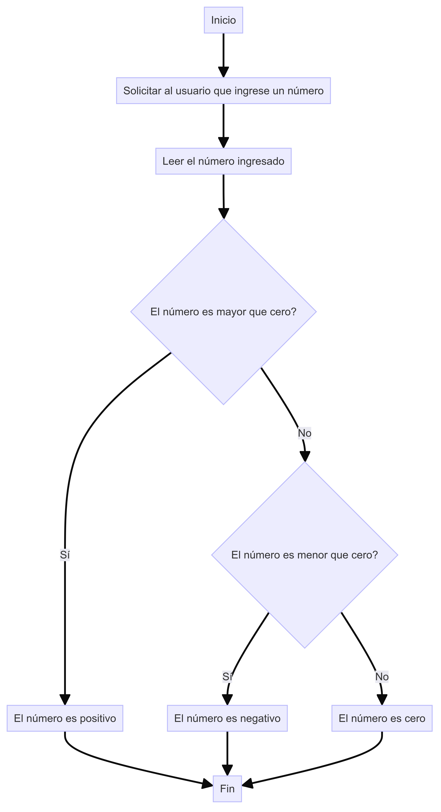

# Estado de un Número

## Descripción
Este proyecto consiste en una aplicación web que determina si un número entero ingresado por el usuario es positivo, negativo o cero. La aplicación está diseñada para ser simple y fácil de usar tanto para principiantes como para expertos.

## Diagrama

## Estructura del Proyecto
El proyecto está compuesto por varias soluciones desarrolladas en diferentes lenguajes y stacks de programación. Cada solución se encuentra en una carpeta separada.

### Soluciones

#### 1. Web Vanilla
**Descripción:** Aplicación web desarrollada en HTML, CSS y JavaScript.

**Archivos:**
- `index.html`: Estructura HTML de la aplicación.
- `style.css`: Estilos CSS para la apariencia de la aplicación.
- `app.js`: Lógica en JavaScript para el cálcular el estado del número.

**Instrucciones:**
1. Abre el archivo `index.html` en tu navegador.
2. Ingresa un número entero en el campo de texto.
3. Haz clic en el botón "Calcular" para ver el resultado.

## Requisitos
- Navegador web moderno (Brave, Chrome, Firefox, Edge, etc.)

## Uso
1. Clona o descarga el repositorio del proyecto.
2. Navega a la carpeta de la solución deseada (por ejemplo, `v1_web_vanilla`).
3. Abre el archivo `index.html` en tu navegador (recomendación: usa live server o live preview para correr este proyecto).

## Ejemplo de Uso
1. Ingresa el número `5` y haz clic en "Calcular".
2. La aplicación mostrará "El número es positivo.".

## Contribuciones
Las contribuciones son bienvenidas. Por favor, sigue las directrices del proyecto para enviar cambios o mejoras.

## Licencia
Este proyecto está bajo la Licencia MIT.
